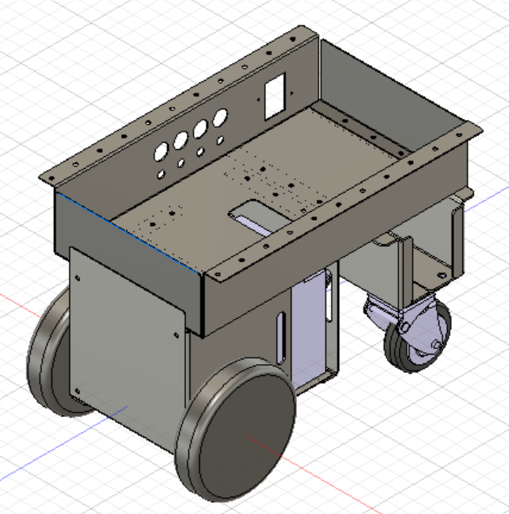

# 廉価版屋外向け移動ロボットプラットフォーム

# 注意事項
## 本プロジェクトのロボットに古いファームウェアであるM1502D_211のモーターを使用すると、速度フィードバック機能を有効にすると制御が発散するのか激しく振動する現象が確認されています。新しいファームウェアであるM1502D_233では制御パラメータの調整が可能となるため改善できる可能性がありますが、現状では入手のめどが立たないため検証できない状態です。オープンループ制御でモーターを回転させることは可能なので、Aruduinoのプログラムを適宜変更して利用するようにしてください。
   
# 概要
このリポジトリは、つくばチャレンジや中之島チャレンジで個人参加しやすい廉価な屋外向け移動ロボットプラットフォームを実現するために立ち上げたものです。
できるだけ廉価になるように設計してみたのですが、材料費は20万円程度となってしまったので、個人が手軽に始められるかどうかはちょっと怪しいです。
私個人が実験的に作成したものなので、質問やissueなどにはできる限り回答しますが、利活用は各々の自己責任のもとで行ってください。
本リポジトリが屋外向け移動ロボット開発の一助となれば幸いです。

# 特徴

- Direct Drive Tech社のタイヤ付きモータを採用

  タイヤの組付けなどの作業を省略した上で、部品数の低減に貢献しています。

- 24V20Ah相当のバッテリー搭載

  12V20Ahの鉛蓄電池を2つ直列に搭載しました。常時フル稼働でモータを駆動させるわけではないのであれば、屋外実験に十分な容量があると考えています。

- 自作のモータコントローラにより非常停止やブレーキ解除を実現

  今回採用したモータには非常停止やブレーキの解除機能がなく、作業性や安全面で問題があったので、制御PCとは独立したArduinoで機能を実現しました。
  何らかの規格に則っているわけではないので、安全性などについては今後の課題となっています。

# リポジトリの構成

- CAD

  様々な3DCADツールで利用しやすいSTEPファイルとROSでシミュレーションする際に利用できるSTLファイルを用意しています。
  
- schematics

  プラットフォームの回路図です。基本的にモータに電源とArduinoをつなげるだけです。

- BoM

  ロボット製作に必要となった部品表とかかった金額のメモです。参考までに。
  
- tools
  
  本リポジトリのロボットを活用するためのツールとして、モータのID変更やコントローラに関するArduinoプロジェクトなどを格納しています。
  
# 参照

- ROSパッケージ

  [reasonable_outdoor_mobile_robot_ros_controller](https://github.com/hijimasa/reasonable_outdoor_mobile_robot_ros_controller)
  
- ROS2パッケージ

  [reasonable_outdoor_mobile_robot_ros2_controller](https://github.com/hijimasa/reasonable_outdoor_mobile_robot_ros2_controller)

